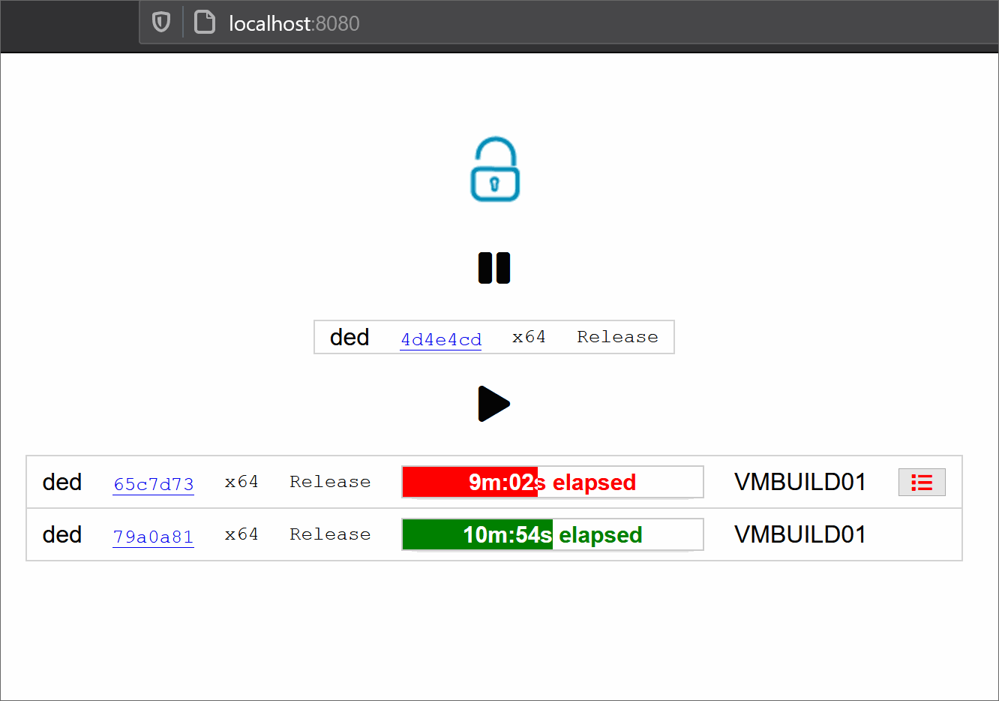
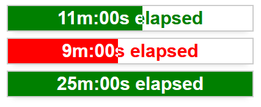

# F# Build Viewer

Sample build viewer application built with .NET Core, F#, Fable, WebSocket.



# SAFE Template
This template can be used to generate a full-stack web application using the [SAFE Stack](https://safe-stack.github.io/). It was created using the dotnet [SAFE Template](https://safe-stack.github.io/docs/template-overview/). If you want to learn more about the template why not start with the [quick start](https://safe-stack.github.io/docs/quickstart/) guide?

## Install pre-requisites
You'll need to install the following pre-requisites in order to build SAFE applications

* The [.NET Core SDK](https://www.microsoft.com/net/download) 3.1 or higher.
* [npm](https://nodejs.org/en/download/) package manager.
* [Node LTS](https://nodejs.org/en/download/).

## Starting the application
Start the server:
```bash
cd src\Server\
dotnet run
```

Start the client:
```bash
npm install
npm run start
```

Open a browser to `http://localhost:8080` to view the site.

## SAFE Stack Documentation
If you want to know more about the full Azure Stack and all of its components (including Azure) visit the official [SAFE documentation](https://safe-stack.github.io/docs/).

You will find more documentation about the used F# components at the following places:

* [Saturn](https://saturnframework.org/docs/)
* [Fable](https://fable.io/docs/)
* [Elmish](https://elmish.github.io/elmish/)

# Context

In our CI/CD, some builds run asynchronously because of various infrastructure constraints. That's why we need a viewer app to see what's going on:

* How many build requests are running?
* How many are queued?
* Are there any errors already in running builds?

# How I created this app

You can look at commit history to identify the changes related to all steps below.

## dotnet template

I used minimal SAFE template:
```dotnet new SAFE -m```

[36356d43](https://github.com/dedale/SAFE-BuildViewer/commit/36356d43a45cce574a9cb52dd8ffaef09fd9acd9)

## Feliz

I prefer `Feliz` over `Fable.React` for the same reasons as in [The Elmish book](https://zaid-ajaj.github.io/the-elmish-book/#/chapters/elm/render-html).

That's why I have migrated the client code to `Feliz`.

[6f62ec84](https://github.com/dedale/SAFE-BuildViewer/commit/6f62ec8434a3e7c42aaa04865122bb62f5ff1d70)

## Shared API (1/2)

Then I start populating my model with various types:

* `BuildStatus`: list of `BuildRequest`
* `BuildRequest`: a request in the queue with various info like platform, configuration, sha1, user, etc.

[2883966e](https://github.com/dedale/SAFE-BuildViewer/commit/2883966ee55ac87dd93458f1391f5b0b164cc23f)

## Client model

I update client model to render a first dummy request.

[dd1b826e](https://github.com/dedale/SAFE-BuildViewer/commit/dd1b826eaa74103680c61a1e9e20766b2203902f)

## Shared API (2/2)

I need to extend current API to include build progress info.

I add the type `BuildProgress` for this matter:

* `Server`: host currently processing this request.
* `Start`: time when this request was removed from queue.
* `ExpectedMin`: expected duration in minutes.
* `Errors`: list of errors found in log.

In `BuildStatus` (list of build requests), I now use a tuple where the second parameter is a `BuildProgress` option.
This allows me to use the same list for the requests still in queue and the ones currently running.

[35a2246d](https://github.com/dedale/SAFE-BuildViewer/commit/35a2246d120054cb92c02628751250d18f7b46e9)

## CSS progress bar

I need a cool progress with inverted colors bar to render build progress.
I found [a cool one in codepen](https://codepen.io/valiooo/pen/qyiov), but unfortunately, it depends on compass.

So I refactored the code to suit my needs with vanilla CSS.
I would have preferred a pure F# solution, but I could not manage to remove all raw css (cf. changes in index.html)



[339f3dd2](https://github.com/dedale/SAFE-BuildViewer/commit/339f3dd24cfe216d6ee485aed89c947088a1e175)

## Render build progress

I update client code to render two sections:

* Queued build requests.
* Running build requests with progress info.

I also do the necessary to use some `FontAwesome` icons.

[932288e1](https://github.com/dedale/SAFE-BuildViewer/commit/932288e16693f3596d8f034529139476b67a49bb)

## Show build errors

In previous commit, I display a red list icon when a running build has errors.

To properly display the list of errors, I want to:

* Show errors when user click on list icon.
* Show errors for only one build at a time.
* Hide errors when clicking again on the same build.

Impacts in client code:

* I update client model to add a `Guid option` for the build with errors displayed.
* I add two client messages to hide or show errors for a specific build.
* The list icon is promoted to a button. When clicked:
  * If build id matches current id, I dispatch a Hide message.
  * Otherwise, this is a Show id message to display errors of this build (and this will automatically hide errors of previous build if needed)

[a14f3193](https://github.com/dedale/SAFE-BuildViewer/commit/a14f3193bc336b8edd3ec50b2971a8d6155503a7)

## WebSocket integration

In many other SAFE applications, most messages are triggered by client events.
Here, the server will continuously analyze the build queue and the builds running in the pool of servers.
So I need to be able to trigger messages on client side from the server.

I found out I can use WebSocket for this matter.

I adapted the code from two other SAFE samples:

* [DieselMeister/raspberrypi-safe-stack-thermometer-example](https://github.com/DieselMeister/raspberrypi-safe-stack-thermometer-example)
* [CompositionalIT/safe-sockets](https://github.com/CompositionalIT/safe-sockets)

Before sending `BuildStatus` updates from the server, in a first step I just update hello message with server uptime.

[13439c4e](https://github.com/dedale/SAFE-BuildViewer/commit/13439c4ecca0278a858e72285c2cb0bdddd5a298)

## Build status updates

In this last step, I remove everything related to hello message.
Client model now starts with an empty list of builds.

On server side:

* I extend `BuildStatus` API with all members needed to:
  * Add a new queued request
  * Start progress of an existing request
  * Add an error to a running request
  * Remove a (finished) request
* I remove the router (not used anymore)
* I update the loop to continuously send `BuildStatus` updates with all operations listed above.

[76d72d23](https://github.com/dedale/SAFE-BuildViewer/commit/76d72d231a5f6c069adc4badd1b9b9eca02355ec)

# Resources

* [The Elmish Book](https://zaid-ajaj.github.io/the-elmish-book/#/)
* [Feliz documentation](https://zaid-ajaj.github.io/Feliz/#/)
* [Redux dev tools](https://safe-stack.github.io/docs/faq-troubleshooting/) to fix browser errors

